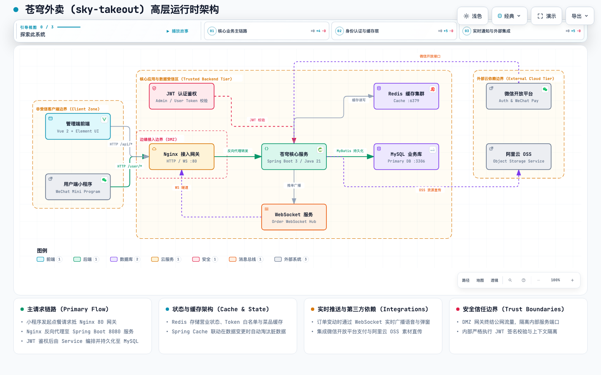
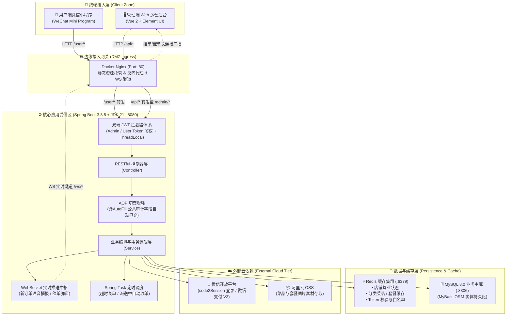
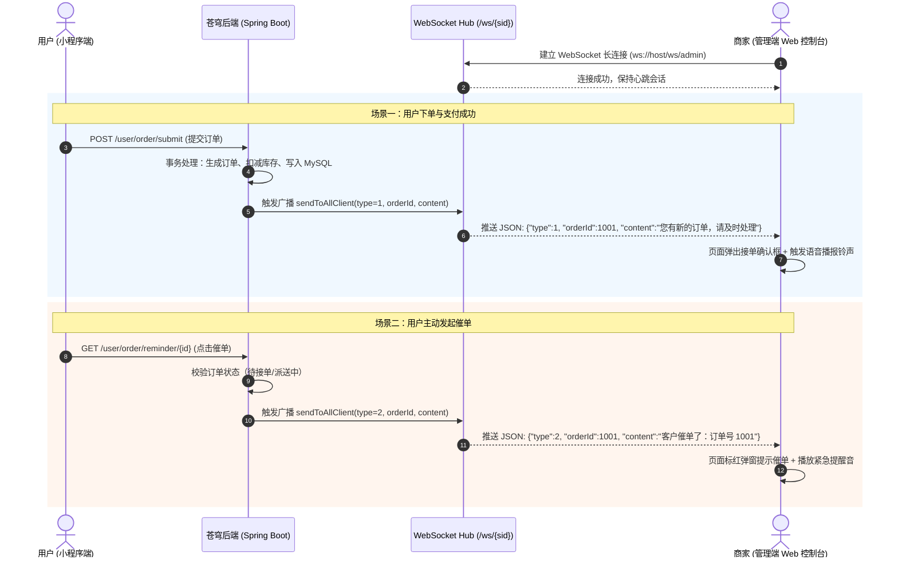
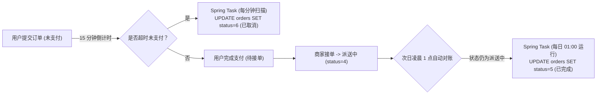

# 🍱 苍穹外卖 (Sky Takeout)

<p align="center">
  
  
  
  
  
  
  
  
</p>

---

## 📖 项目简介

**苍穹外卖 (Sky Takeout)** 是一套基于 **Spring Boot 3.3.5 + JDK 21 + MyBatis + Redis** 构建的企业级全功能外卖点餐与数字化运营管理系统。系统深度整合了现代主流技术栈，涵盖**管理端（Vue 2 + Element UI 运营后台）** 与 **用户端（微信小程序 / WeChat Mini Program）**，覆盖菜品管理、多规格口味定制、套餐组合联动、智能购物车、微信授权与在线支付、订单调度工作流、全双工 WebSocket 实时通知、Spring Task 自动化任务引擎以及多维运营数据可视化报表等全链路业务闭环。

项目注重生产级代码规范与高内聚低耦合的分层架构设计，落地了 AOP 审计字段自动填充、双端 JWT 鉴权与 ThreadLocal 线程上下文隔离、基于 Spring Cache 与 Redis 的多级缓存治理、Apache POI 运营报表导出及 Docker 容器化编排等企业实战方案。

---

## 🏗️ 系统架构设计

### 1. 运行时高层架构与信任边界 (Runtime Architecture)

系统采用清晰的分层与安全域隔离设计，严格划分外部非受信客户端、DMZ 边缘接入网关、核心应用与数据受信区以及外部第三方云依赖四大信任边界：

<p align="center">
  
</p>

> 💡 **交互式架构图**：查看支持主题切换（浅色/深色）、引导式视角 (Guided Views) 与高清矢量导出的独立交互式架构图：[sky-takeout-architecture.html](./docs/architecture/sky-takeout-architecture.html)。

### 2. 系统拓扑与数据流转



---

## 🛠️ 技术栈清单

| 分类 | 技术组件 | 推荐版本 | 说明 |
| :--- | :--- | :--- | :--- |
| **开发语言** | Java | JDK 21 | 核心编程语言（虚拟线程与现代语法特性） |
| **核心框架** | Spring Boot | 3.3.5 | 企业级微服务开发基础底座 |
| **持久层** | MyBatis + PageHelper | 3.0.3 / 1.4.6 | 持久层 ORM 映射器与物理分页插件 |
| **数据库** | MySQL | 8.0+ | 核心业务关系型数据存储 |
| **缓存中间件** | Redis + Spring Cache | 6.0+ / 内置 | 声明式缓存加速、营业状态与会话存储 |
| **实时通信** | Jakarta WebSocket | 3.0+ | 服务端全双工推单与催单长连接通知 |
| **安全鉴权** | JJWT (Java JWT) | 0.9.1 | 双端无状态 Token 签名验证与会话拦截 |
| **定时调度** | Spring Task | 内置 | Cron 表达式驱动的超时自动关单与归档 |
| **对象存储** | Aliyun OSS SDK | 3.17.4 | 阿里云云端对象存储与图片资源上传 |
| **移动支付** | WeChat Pay SDK | 0.4.8 | 微信小程序支付接入与退款通知 |
| **接口文档** | Knife4j (Swagger 3) | 3.0.2 | 交互式 RESTful 接口可视化调试工具 |
| **报表导出** | Apache POI | 4.1.2 | 运营数据 Excel 动态报表生成与下载 |
| **代码简化** | Lombok | 1.18.30 | 消除 Getter/Setter 及 Builder 样板代码 |
| **前端/部署** | Docker + Nginx | stable-alpine | 前端 Vue SPA 静态托管与统一反向代理 |

---

## 🌟 核心业务方案与技术攻坚

### 1. ⚡ 全双工 WebSocket 实时推单与催单调度中枢

针对外卖业务场景中对**新订单即时响应**、**语音播报提醒**与**用户催单实时预警**的高实时性诉求，系统基于 WebSocket 协议构建了双向通信中枢：



- **全连接会话池管理**：通过 `ConcurrentHashMap<String, Session>` 维护活跃的管理端客户端会话，支持精准推送与全局广播。
- **动静协议分离**：Nginx 80 端口配置 `proxy_set_header Upgrade $http_upgrade`，将 `/ws/` 请求透明穿透至后端 WebSocket 端点。

---

### 2. 🍲 菜品与套餐多级缓存与精准主动失效治理

系统针对高频访问的用户端菜品/套餐列表，采用 **Spring Cache + RedisTemplate** 组合治理方案，在确保百万级 QPS 毫秒级响应的同时，严格保障数据强一致性：

| 缓存数据类型 | 缓存 Key 模式 | 存储结构 | 策略与失效时机 |
| :--- | :--- | :--- | :--- |
| **店铺营业状态** | `SHOP_STATUS` | `Integer (0/1)` | 管理端更改营业状态时即时 `SET`，用户端与管理端全量共享读取 |
| **分类菜品列表** | `dish_category_{categoryId}` | `String (JSON)` | 基于 `RedisTemplate` 手动缓存。管理端新增/修改/起售停售/删除菜品时，批量执行 `DEL dish_*` 清除脏缓存 |
| **分类套餐列表** | `setmeal_category_::{categoryId}` | `String (JSON)` | 基于 Spring Cache `@Cacheable` 自动装载。套餐数据变更时触发 `@CacheEvict(allEntries = true)` 精准驱逐 |

- **Cache-Aside 模式**：修改数据时优先执行数据库事务提交，事务成功后再行驱逐 Redis 缓存，防止脏读。
- **分类精确粒度淘汰**：修改菜品时仅需根据受影响的 `categoryId` 进行精准或通配符批量清理，避免全量穿透。

---

### 3. ⏱️ Spring Task 自动化订单生命周期流转

借助 Spring Task 定时任务引擎，实现外卖订单全生命周期的自动化状态机流转：



- **超时订单自动关闭**：`@Scheduled(cron = "0 * * * * ?")` 每分钟检索 `status = 1 AND order_time < NOW() - 15min` 的订单，批量关闭并释放库存。
- **派送中订单自动收单**：`@Scheduled(cron = "0 0 1 * * ?")` 每日凌晨自动结算昨日未手动确认的派送订单，平滑对账逻辑。

---

### 4. 🔐 双端独立 JWT 鉴权与 ThreadLocal 上下文隔离

- **双端隔离拦截器**：
  - `JwtTokenAdminInterceptor`：拦截 `/admin/**` 路径，校验管理端颁发的签名与有效期。
  - `JwtTokenUserInterceptor`：拦截 `/user/**` 路径，校验基于微信 `openid` 注册的用户 Token。
- **ThreadLocal 全链路上下文传递**：拦截器鉴权成功后，将提取出的 `empId` / `userId` 注入自定义线程上下文 `BaseContext`，在后续的 Controller、Service、Mapper 及 AOP 切面中无缝随时获取，并在 `afterCompletion` 中主动执行 `remove()`，彻底规避线程池复用导致的内存泄漏与数据污染。

---

### 5. 🏷️ 自定义注解 `@AutoFill` + AOP 自动化公共字段填充

针对数据库表中的 4 大通用审计字段（`create_time`, `update_time`, `create_user`, `update_user`），构建了基于注解和反射的 AOP 自动化切面：
- **自定义注解**：`@AutoFill(value = OperationType.INSERT / UPDATE)` 标记在 Mapper 接口方法上；
- **切面拦截与反射赋值**：`AutoFillAspect` 拦截所有标注 `@AutoFill` 的方法，获取入参实体对象，结合 `BaseContext.getCurrentId()` 与 `LocalDateTime.now()`，通过反射动态调用对应的 `setCreateTime` / `setUpdateUser` 方法，消除 100% 重复样板代码。

---

## 🗃️ Redis 数据模型与 Key 规范全景表

| Key 规范模式 | 数据类型 | 默认 TTL | 业务场景说明 | 核心操作命令 |
| :--- | :--- | :--- | :--- | :--- |
| `SHOP_STATUS` | `Integer` | 永久 | 店铺全局营业状态（1: 营业中, 0: 打烊） | `GET`, `SET` |
| `dish_category_{id}` | `String (JSON)` | 永久 / 主动失效 | 用户端指定分类下的在售菜品列表缓存 | `GET`, `SET`, `DEL` |
| `setmeal_category_::{id}`| `String (JSON)` | 永久 / 主动失效 | 用户端指定分类下的在售套餐列表缓存 (Spring Cache) | `GET`, `SET`, `DEL` |
| `admin:token:{empId}` | `String` | 2 小时 | 管理端员工登录 Token 会话与踢出控制 | `SETEX`, `GET`, `DEL` |
| `user:token:{userId}` | `String` | 7 天 | 用户端小程序登录访问 Token | `SETEX`, `GET` |

---

## 📂 项目工程结构规范

```
sky-takeout/
├── .env.example                               # 环境变量配置模板
├── pom.xml                                    # Maven 聚合父 POM 管控
├── README.md                                  # 项目工程规范与说明文档
├── docs/                                      # 设计文档与静态架构图资源
│   └── architecture/
│       ├── sky-takeout-architecture.html      # 交互式高层运行时架构图 (可直接在浏览器打开)
│       └── sky-takeout-architecture.png       # 架构高清全景图
│
├── takeout-common/                            # 【通用基础模块】(纯底层工具，零业务耦合)
│   ├── pom.xml
│   └── src/main/java/com/li/common/
│       ├── constant/                          # 业务常量定义 (AutoFill, Message, Status, JwtClaims)
│       ├── context/                           # ThreadLocal 线程上下文 (BaseContext)
│       ├── enumeration/                       # 业务枚举类 (OperationType)
│       ├── exception/                         # 自定义业务异常体系 (BaseException, AccountNotFoundException 等)
│       ├── json/                              # Jackson 序列化与精度处理器 (JacksonObjectMapper)
│       ├── properties/                        # 强类型配置属性绑定 (AliOssProperties, JwtProperties, WeChatProperties)
│       ├── result/                            # 统一 REST 响应封装 (Result<T>, PageResult)
│       └── utils/                             # 工具类库 (JwtUtil, MD5Util, AliOssUtil, HttpClientUtil, WeChatPayUtil)
│
├── takeout-pojo/                              # 【实体与模型传输模块】
│   ├── pom.xml
│   └── src/main/java/com/li/pojo/
│       ├── dto/                               # 数据传输对象 (EmployeeLoginDTO, DishDTO, OrdersSubmitDTO 等)
│       ├── entity/                            # 数据库持久化实体 (Employee, Category, Dish, Setmeal, Orders 等)
│       └── vo/                                # 视图展示对象 (DishVO, OrderVO, SalesTop10ReportVO, OrderReportVO 等)
│
└── takeout-server/                            # 【核心业务与服务层模块】
    ├── pom.xml
    └── src/
        ├── main/
        │   ├── java/com/li/
        │   │   ├── TakeoutApplication.java     # Spring Boot 引导启动类
        │   │   ├── annotation/                # 自定义注解定义 (@AutoFill)
        │   │   ├── aspect/                    # AOP 切面实现 (AutoFillAspect)
        │   │   ├── config/                    # 核心配置 (WebMvcConfiguration, RedisConfiguration, OssConfiguration)
        │   │   ├── controller/                # 控制器层 (admin/ 商家运营, user/ 小程序用户端, notify/ 支付回调)
        │   │   ├── handler/                   # 全局异常处理器 (GlobalExceptionHandler)
        │   │   ├── interceptor/               # 双端 JWT 认证拦截器 (JwtTokenAdminInterceptor, JwtTokenUserInterceptor)
        │   │   ├── mapper/                    # MyBatis Mapper 数据访问接口
        │   │   ├── service/                   # 核心业务接口及实现类 (impl/)
        │   │   ├── task/                      # Spring Task 定时任务引擎 (OrderTask)
        │   │   └── websocket/                 # WebSocket 服务端实现 (WebSocketServer)
        │   └── resources/
        │       ├── application.yml            # 核心主配置文件
        │       ├── application-dev.yml        # 开发环境差异化配置 (连接池、Key、端口)
        │       ├── db/
        │       │   └── sky.sql                # 数据库初始化表结构与初始基础数据
        │       ├── mapper/                    # MyBatis XML 动态 SQL 映射文件
        │       └── nginx/                     # 前端静态包与 Nginx 反向代理配置
        └── test/                              # 自动化回归测试与基准测试代码
```

---

## 🚀 环境准备与快速启动

### 1. 环境依赖要求

- **JDK**: 21 或更高版本
- **Maven**: 3.8.0+（支持使用项目内置 Maven Wrapper）
- **MySQL**: 8.0+
- **Redis**: 6.0+
- **Docker**: 用于一键拉起 Nginx 前端容器（推荐）

---

### 2. 本地快速部署步骤

#### Step 1: 导入数据库脚本
创建 `sky_take_out` 数据库并导入项目预置的完整 SQL 脚本：
```bash
mysql -u root -p -e "CREATE DATABASE IF NOT EXISTS sky_take_out DEFAULT CHARACTER SET utf8mb4 COLLATE utf8mb4_unicode_ci;"
mysql -u root -p sky_take_out < takeout-server/src/main/resources/db/sky.sql
```

#### Step 2: 配置环境变量
从模板复制环境变量配置文件：
```bash
cp .env.example .env
```
根据本地环境编辑 `.env`（或在 `application-dev.yml` 中调整）：
```dotenv
# MySQL 数据库与 Redis 连接密码
PASSWORD=your_password

# 阿里云 OSS 密钥配置 (可选，本地不填保持占位符不影响基础业务)
OSS_ACCESS_KEY_ID=your_alioss_access_key_id
OSS_ACCESS_KEY_SECRET=your_alioss_access_key_secret

# 微信小程序开发者配置 (可选)
WECHAT_APP_ID=your_wechat_app_id
WECHAT_SECRET=your_wechat_secret
```

#### Step 3: 启动前端 Web 服务 (Docker Nginx)
利用 Docker 一键挂载启动管理端 Nginx 前端：
```bash
docker run -d \
  --name sky-take-out-nginx \
  -p 80:80 \
  -v $(pwd)/takeout-server/src/main/resources/nginx/conf/nginx.conf:/etc/nginx/nginx.conf:ro \
  -v $(pwd)/takeout-server/src/main/resources/nginx/html:/usr/share/nginx/html:ro \
  nginx:stable-alpine
```
> 前端 Web 控制台访问入口：[http://localhost:80](http://localhost:80)

#### Step 4: 编译与启动后端核心服务
```bash
# 根目录下全工程编译
mvn clean package -DskipTests

# 启动 Spring Boot 服务
mvn -pl takeout-server spring-boot:run
```
后端服务默认监听端口：`http://localhost:8080`。

#### Step 5: 验证服务与接口文档
- **管理端 Web 界面**: [http://localhost:80](http://localhost:80)
- **Knife4j (Swagger 3) 交互式 API 文档**: [http://localhost:8080/doc.html](http://localhost:8080/doc.html)

---

## 🧪 测试账号与自动化测试指南

### 1. 管理端预设测试账号

| 账号属性 | 默认值 | 权限与用途 |
| :--- | :--- | :--- |
| **用户名** | `admin` | 超级管理员 |
| **初始明文密码** | `123456` | MD5 散列存储 (`e10adc3949ba59abbe56e057f20f883e`) |
| **关联姓名 / 手机** | 管理员 / `13812312312` | 具备员工管理、店铺管理、菜品套餐、订单调度及数据统计全部权限 |

### 2. 用户端认证说明
- 用户端点餐基于微信 `wx.login` 授权体系，传入 `code` 后端自动置换 `openid`，首次登录自动生成对应 `user` 记录并签发 Token。

### 3. Playwright E2E 全流程自动化测试报告

项目经过 **Playwright CLI** 端到端自动化回归测试，验证覆盖了前端 SPA 路由、状态机流转与后端 REST API 的全链路交互：

| 测试场景 / 页面 | 核心验证能力与断言项 | 状态 | 控制台错误数 |
| :--- | :--- | :---: | :---: |
| **登录与身份鉴权** | 账号密码校验、JWT Token 本地持久化、路由自动重定向 | ✅ `PASSED` | `0 Errors` |
| **运营数据工作台** | 今日营业额、有效订单数、订单完成率、待处理订单动态卡片 | ✅ `PASSED` | `0 Errors` |
| **员工管理与状态切换** | 员工列表分页检索、新增员工、启用/禁用状态实时变更 | ✅ `PASSED` | `0 Errors` |
| **分类与菜品中心** | 菜品多口味配置绑定、批量删除、启售/停售状态联动 | ✅ `PASSED` | `0 Errors` |
| **套餐组合与详情** | 套餐关联多菜品明细、批量删除、起售状态动态更新 | ✅ `PASSED` | `0 Errors` |
| **订单调度与接单** | 订单综合多条件检索、接单/拒单/派送/完成状态机流转 | ✅ `PASSED` | `0 Errors` |
| **多维统计报表** | 营业额走势折线图、有效订单统计、TOP10 销量排行榜、空数据优雅降级 | ✅ `PASSED` | `0 Errors` |
| **店铺营业状态管控** | 营业/打烊一键切换、全端实时同步与 Redis 状态缓存 | ✅ `PASSED` | `0 Errors` |

---

## 📡 RESTful 核心 API 接口清单

| 业务模块 | 请求方式 | 接口路径 | 功能说明 | 鉴权要求 |
| :--- | :--- | :--- | :--- | :---: |
| **员工管理** | `POST` | `/admin/employee/login` | 员工账号登录（获取 JWT Token） | 否 |
| | `GET` | `/admin/employee/logout` | 员工退出登录（清理会话） | 是 |
| | `POST` | `/admin/employee` | 新增员工账号 | 是 |
| | `GET` | `/admin/employee/page` | 分页多条件检索员工列表 | 是 |
| | `GET` | `/admin/employee/{id}` | 根据主键 ID 查询员工详情 | 是 |
| | `POST` | `/admin/employee/status/{status}` | 启用 / 禁用员工账号状态 | 是 |
| | `PUT` | `/admin/employee/password` | 修改员工密码 | 是 |
| | `PUT` | `/admin/employee` | 编辑员工基本资料 | 是 |
| **分类管理** | `POST` | `/admin/category` | 新增菜品 / 套餐分类 | 是 |
| | `GET` | `/admin/category/page` | 分页查询分类列表 | 是 |
| | `PUT` | `/admin/category` | 修改分类信息 | 是 |
| | `POST` | `/admin/category/status/{status}` | 启用 / 禁用分类状态 | 是 |
| | `GET` | `/admin/category/list` | 根据类型获取分类下拉列表 | 是 |
| | `DELETE` | `/admin/category` | 根据 ID 删除分类 | 是 |
| **菜品管理** | `POST` | `/admin/dish` | 新增菜品及关联口味配置 | 是 |
| | `GET` | `/admin/dish/page` | 菜品分页多条件查询 | 是 |
| | `GET` | `/admin/dish/{id}` | 根据 ID 获取菜品详情与口味列表 | 是 |
| | `GET` | `/admin/dish/list` | 根据分类 ID 查询在售菜品列表 | 是 |
| | `PUT` | `/admin/dish` | 修改菜品及口味信息 | 是 |
| | `POST` | `/admin/dish/status/{status}` | 菜品批量 / 单个起售与停售 | 是 |
| | `DELETE` | `/admin/dish` | 批量删除菜品（含起售/套餐关联校验） | 是 |
| **套餐管理** | `POST` | `/admin/setmeal` | 新增套餐及关联菜品列表 | 是 |
| | `GET` | `/admin/setmeal/page` | 套餐分页条件查询 | 是 |
| | `GET` | `/admin/setmeal/{id}` | 根据 ID 查询套餐详情及菜品组成 | 是 |
| | `PUT` | `/admin/setmeal` | 修改套餐及关联菜品 | 是 |
| | `POST` | `/admin/setmeal/status/{status}` | 套餐起售与停售状态切换 | 是 |
| | `DELETE` | `/admin/setmeal` | 批量删除套餐 | 是 |
| **订单调度** | `GET` | `/admin/order/conditionSearch` | 订单多维度复合条件分页搜索 | 是 |
| | `GET` | `/admin/order/details/{id}` | 查询订单详情与商品清单 | 是 |
| | `GET` | `/admin/order/statistics` | 各状态订单数量统计汇总 | 是 |
| | `PUT` | `/admin/order/confirm` | 商家确认接单 | 是 |
| | `PUT` | `/admin/order/rejection` | 商家拒单并记录原因 | 是 |
| | `PUT` | `/admin/order/delivery/{id}` | 订单派送出库 | 是 |
| | `PUT` | `/admin/order/cancel` | 商家主动取消订单 | 是 |
| | `PUT` | `/admin/order/complete/{id}` | 商家确认订单已送达完成 | 是 |
| **数据统计** | `GET` | `/admin/report/turnoverStatistics` | 营业额走势数据统计 | 是 |
| | `GET` | `/admin/report/userStatistics` | 用户总量与每日新增统计 | 是 |
| | `GET` | `/admin/report/ordersStatistics` | 订单总量与有效订单率统计 | 是 |
| | `GET` | `/admin/report/top10` | 指定时间区间销量排行榜 TOP10 | 是 |
| | `GET` | `/admin/report/export` | 导出近 30 天核心运营数据 Excel 报表 | 是 |
| **工作台概览**| `GET` | `/admin/workspace/businessData` | 今日营业额、有效订单及完成率指标 | 是 |
| | `GET` | `/admin/workspace/overviewOrders` | 待接单、待派送、已完成订单看板 | 是 |
| | `GET` | `/admin/workspace/overviewDishes` | 起售与停售菜品概览 | 是 |
| | `GET` | `/admin/workspace/overviewSetmeals` | 起售与停售套餐概览 | 是 |
| **店铺与通用**| `PUT` | `/admin/shop/{status}` | 设置店铺营业状态（1:营业中, 0:打烊） | 是 |
| | `GET` | `/admin/shop/status` | 获取当前店铺营业状态 | 否 |
| | `POST` | `/admin/common/upload` | 上传图片文件至阿里云 OSS | 是 |
| **用户小程序**| `POST` | `/user/user/login` | 微信一键授权登录并获取 Token | 否 |
| | `GET` | `/user/category/list` | 查询在售商品分类列表 | 否 |
| | `GET` | `/user/dish/list` | 查询指定分类在售菜品（含口味） | 否 |
| | `GET` | `/user/setmeal/list` | 查询指定分类在售套餐（带 Redis 缓存） | 否 |
| | `GET` | `/user/setmeal/dish/{id}` | 查询套餐包含的菜品组成详情 | 否 |
| | `POST` | `/user/shoppingCart/add` | 菜品 / 套餐加购至购物车 | 是 |
| | `GET` | `/user/shoppingCart/list` | 获取当前用户购物车清单 | 是 |
| | `POST` | `/user/shoppingCart/sub` | 购物车商品数量减一 | 是 |
| | `DELETE` | `/user/shoppingCart/clean` | 清空当前用户购物车 | 是 |
| | `POST` | `/user/order/submit` | 用户提交订单并锁定金额 | 是 |
| | `PUT` | `/user/order/payment` | 订单微信支付与结算回调 | 是 |
| | `GET` | `/user/order/historyOrders` | 分页查询个人历史订单 | 是 |
| | `GET` | `/user/order/orderDetail/{id}` | 查询个人订单明细 | 是 |
| | `PUT` | `/user/order/cancel/{id}` | 用户主动取消未支付订单 | 是 |
| | `GET` | `/user/order/reminder/{id}` | 订单催单（触发后台 WebSocket 报警） | 是 |
| | `POST` | `/user/addressBook` | 新增收货地址 | 是 |
| | `GET` | `/user/addressBook/list` | 查询当前用户全部收货地址 | 是 |
| | `PUT` | `/user/addressBook/default` | 设置默认收货地址 | 是 |

---

## ❓ 常见问题排查 (FAQ)

### 1. 运行项目提示 Java 版本不兼容或 ClassNotFound？
- 本项目基于 **JDK 21** 开发并使用了 Spring Boot 3.3.5。请确保本地安装了 JDK 21+，并在 IDE（如 IntelliJ IDEA）中将 Project SDK 和 Java Compiler Target 均设置为 21。

### 2. 管理端使用 `admin` / `123456` 提示密码错误？
- 系统在 `EmployeeServiceImpl` 中使用 MD5 对输入的明文密码进行散列校验（`123456` 的 MD5 值为 `e10adc3949ba59abbe56e057f20f883e`）。请确保初始化数据库时使用的是完整的 `sky.sql`，其中的初始管理员密码已默认经过 MD5 处理。

### 3. Nginx 页面打开提示网络异常或反向代理 502？
- 确认 Nginx 容器正常运行（`docker ps`），且 80 端口无冲突。
- 检查 `takeout-server/src/main/resources/nginx/conf/nginx.conf` 中的反向代理配置：确认 `/api/` 代理路径正确指向宿主机的后端 `8080` 端口。

### 4. 如何在无真实阿里云 OSS 或微信商户 Key 的情况下进行本地调试？
- 数据库与业务核心逻辑不强依赖第三方 Key。本地开发时可在 `application-dev.yml` 或 `.env` 中保留占位符，菜品图片可直接在数据库或通过 SQL 手动指定在线图片 URL 进行展示与点餐测试。

---

## 📄 开源许可证

本项目基于 [MIT License](LICENSE) 开源。
