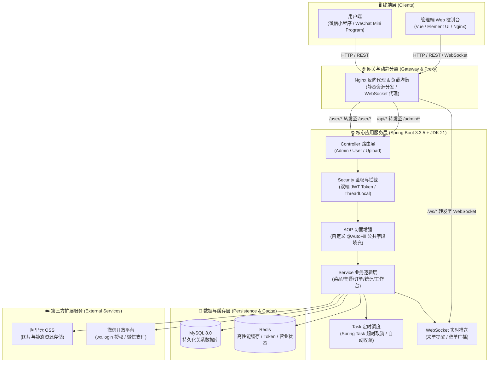

# 苍穹外卖系统 (Sky Takeout)

<p align="center">
  
  
  
  
  
  
  
</p>

**苍穹外卖** 是一套基于 **Spring Boot 3.3.5 + JDK 21 + MyBatis + Redis** 构建的企业级全功能外卖点餐与运营管理系统。系统包含 **管理端（Web 运营后台）** 与 **用户端（微信小程序）**，覆盖菜品管理、套餐定制、智能购物车、在线支付、订单调度、全双工 WebSocket 实时通知、自动化定时任务及多维数据统计图表等全链路业务能力。

---

## 📑 目录

- [🌟 系统架构](#-系统架构)
- [🚀 技术栈选型](#-技术栈选型)
- [✨ 核心功能特性](#-核心功能特性)
- [💡 关键技术与设计亮点](#-关键技术与设计亮点)
- [📁 项目工程结构](#-项目工程结构)
- [🛠️ 环境要求](#️-环境要求)
- [📦 快速开始与部署指南](#-快速开始与部署指南)
- [👤 测试账号与预置数据](#-测试账号与预置数据)
- [📚 API 接口清单](#-api-接口清单)
- [🔧 常见问题与排错 (FAQ)](#-常见问题与排错-faq)
- [🤝 参与贡献](#-参与贡献)
- [📄 开源协议](#-开源协议)

---

## 🌟 系统架构



---

## 🚀 技术栈选型

### 后端核心

| 技术 | 说明 | 版本 |
| :--- | :--- | :--- |
| **Java** | 现代核心编程语言 (采用虚拟线程及语法新特性) | JDK 21 |
| **Spring Boot** | 微服务基础底座框架 | 3.3.5 |
| **MyBatis** | 持久层 ORM 框架及映射器 | 3.0.3 |
| **PageHelper** | MyBatis 物理分页插件 | 1.4.6 |
| **MySQL** | 主流关系型数据库 | 8.0+ |
| **Redis** | 分布式内存缓存与会话存储 | 6.0+ |
| **Spring Cache** | 声明式缓存管理框架 | 内置 |
| **Spring Task** | 内置定时任务调度引擎 | 内置 |
| **WebSocket** | 全双工双向实时通信协议 | Jakarta WebSocket |
| **JWT (JJWT)** | 无状态 Token 身份认证鉴权 | 0.9.1 |
| **Aliyun OSS** | 阿里云对象存储 SDK | 3.17.4 |
| **WeChat Pay SDK**| 微信支付 V3 Apache HttpClient 组件 | 0.4.8 |
| **FastJSON / Jackson** | 高性能 JSON 序列化与反序列化工具 | 2.0.15 |
| **Knife4j** | 基于 Swagger 的交互式 API 接口文档 | 3.0.2 |
| **Lombok** | 实体类代码简化辅助插件 | 最新 |

### 运维与前端配套

- **Nginx**: 反向代理、动静分离与前端静态资源托管
- **Maven**: 项目构建与依赖生命周期管理
- **Docker**: 容器化快速部署支持

---

## ✨ 核心功能特性

### 1. 🏢 管理端（商家运营后台）

- **员工与权限体系**: 员工信息维护 (CRUD)、账号状态切换 (启用/禁用)、MD5 密码加密与重置、基于 JWT 的多端会话注销。
- **店铺营业管控**: 一键设置店铺营业/打烊状态，全端实时同步。
- **分类管理**: 菜品分类与套餐分类的层级维护、启用与排序。
- **菜品中心**: 菜品增删改查、多规格口味选项绑定（辣度/甜度/忌口等）、菜品批量删除、起售与停售联动。
- **套餐管理**: 套餐基础信息维护、套餐与多菜品关系组合绑定、套餐起售/停售状态切换及批量删除。
- **订单调度中枢**: 订单综合条件多维度检索、接单、拒单（记录原因）、派送、取消订单及完成订单全流程跟踪。
- **实时播报中心**: 结合 WebSocket 实现**新订单语音/弹窗播报**与**用户催单实时推送**。
- **数据统计与可视化报表**:
  - 营业额走势统计 (折线图数据支持)
  - 用户总量与每日新增统计
  - 订单总数与有效订单率统计
  - 畅销菜品与套餐销量 TOP10 排行榜
- **工作台概览**: 今日营业额、有效订单、新增用户、今日完成率以及待处理订单看板。

### 2. 📱 用户端（微信小程序）

- **微信一键登录**: 基于微信 `wx.login` 获取 Code，换取唯一 `openid` 自动注册登录并生成访问 Token。
- **在线点餐浏览**: 分类导航、菜品列表、口味偏好自选、套餐明细查看。
- **智能购物车**: 菜品与套餐加购、口味多规格拆分、数量增减、购物车实时清空与总价计算。
- **收货地址簿**: 收货人信息维护、多级省市区选择、默认地址一键设置。
- **订单结算与支付**: 下单结算、模拟/接入微信支付、订单生成及倒计时。
- **订单追踪与催单**: 查看历史订单列表、订单状态流转、一键催单触发后台 WebSocket 报警。

---

## 💡 关键技术与设计亮点

### 1. 自定义注解与 AOP 自动化公共字段填充
针对数据库表中的公共审计字段（`create_time`, `update_time`, `create_user`, `update_user`），通过自定义 `@AutoFill` 注解配合 `AutoFillAspect` 切面，在 Mapper 执行 `INSERT` 或 `UPDATE` 前拦截并通过反射自动赋值，同时结合 `ThreadLocalUtil` 线程上下文获取当前登录用户 ID，大幅减少样板代码并保证数据一致性。

### 2. 多级缓存策略与精准失效机制
- 采用 **Spring Cache** (`@Cacheable(cacheNames = "setmeal_category_")`) 缓存用户端高频套餐列表。
- 采用 **RedisTemplate** 缓存用户端分类菜品列表（`dish_category_*`）。
- 在管理端对菜品/套餐进行新增、修改、起售停售或删除时，执行精确的 Key 失效操作，保证缓存与数据库强一致。

### 3. WebSocket 实时双向通信
基于 `@ServerEndpoint("/ws/{sid}")` 实现服务端与管理端长连接。当用户下单或发起催单时，后端即时将消息封装为 JSON 结构广播至管理端前端页面，无需轮询即可实现秒级弹窗与铃声提醒。

### 4. Spring Task 自动化订单状态流转
- **超时订单自动关闭**: 定时任务每分钟运行一次 (`@Scheduled(cron = "0 * * * * ?")`)，自动扫描并关闭超过 15 分钟未支付的超时订单。
- **派送订单自动完结**: 每日凌晨 1 点 (`@Scheduled(cron = "0 0 1 * * ?")`)，自动将前一天处于“派送中”状态的已支付订单批量变更为“已完成”。

### 5. 双端 JWT 鉴权与 ThreadLocal 上下文隔离
分别配置管理端拦截器 `JwtTokenAdminInterceptor` 与用户端拦截器 `JwtTokenUserInterceptor`，独立配置 SecretKey 与 TTL，并在校验成功后将主键放入 `ThreadLocalUtil` 中供全链路请求随时获取。

---

## 📁 项目工程结构

```
sky-takeout/
├── README.md                              # 项目说明文档
├── pom.xml                                # Maven 根工程 Parent POM (依赖与版本聚合管控)
├── .env.example                           # 环境变量配置示例模板
├── mvnw / mvnw.cmd                        # Maven 包装器
│
├── takeout-common/                        # 【通用基础模块】(纯底层库，零业务依赖)
│   ├── pom.xml
│   └── src/main/java/com/li/common/
│       ├── constant/                      # 常量定义 (JwtClaims, Message, Status, AutoFill)
│       ├── enumeration/                   # 业务枚举类 (OperationType)
│       ├── exception/                     # 自定义业务异常体系 (BaseException及子类)
│       ├── json/                          # Jackson 序列化与精度处理 (JacksonObjectMapper)
│       ├── properties/                    # 强类型配置属性类 (AliOss, Jwt, WeChat)
│       ├── result/                        # 统一响应结构 (Result, PageResult)
│       └── utils/                         # 工具包 (Jwt, MD5, AliOss, WebSocket, WeChatPay, ThreadLocal)
│
├── takeout-pojo/                          # 【实体与数据传输模型模块】
│   ├── pom.xml
│   └── src/main/java/com/li/pojo/
│       ├── dto/                           # 数据传输对象 (Data Transfer Objects)
│       ├── entity/                        # 数据库持久化实体类 (ORM Entity)
│       └── vo/                            # 视图展示对象 (View Objects)
│
└── takeout-server/                        # 【核心业务与服务模块】
    ├── pom.xml
    └── src/
        ├── main/
        │   ├── java/com/li/
        │   │   ├── TakeoutApplication.java # Spring Boot 引导启动类
        │   │   ├── annotation/            # 自定义注解 (@AutoFill)
        │   │   ├── aspect/                # AOP 切面 (公共字段自动填充)
        │   │   ├── config/                # 框架配置 (WebMvc, Redis, Oss, WebSocket)
        │   │   ├── controller/            # 控制器层 (admin, user, upload)
        │   │   ├── handler/               # 全局异常捕获器 (GlobalExceptionHandler)
        │   │   ├── interceptor/           # JWT 身份认证拦截器 (Admin / User)
        │   │   ├── mapper/                # MyBatis 数据访问接口
        │   │   └── service/               # 业务接口及具体实现层 (impl)
        │   └── resources/
        │       ├── application.yml        # 核心基础配置文件
        │       ├── application-dev.yml    # 开发环境个性化配置
        │       ├── db/
        │       │   └── sky.sql            # 数据库初始化表结构与初始测试数据
        │       ├── mapper/                # MyBatis XML 动态 SQL 映射文件
        │       └── nginx/                 # Nginx 前端打包静态资源与反向代理配置文件
        └── test/                          # 单元测试与集成测试代码
```

---

## 🛠️ 环境要求

- **操作系统**: macOS / Linux / Windows
- **Java 开发包**: JDK 21 或更高版本
- **构建工具**: Maven 3.8.0 或更高版本
- **关系数据库**: MySQL 8.0 或更高版本
- **缓存数据库**: Redis 6.0 或更高版本
- **代理与网关 (可选)**: Nginx 1.20+ (或使用 Docker 运行前端)

---

## 📦 快速开始与部署指南

### 1. 克隆代码仓库

```bash
git clone https://github.com/e69d8e/sky-takeout.git
cd sky-takeout
```

### 2. 初始化数据库

1. 登录本地或远程 MySQL 服务，创建 `sky_take_out` 数据库：
   ```sql
   CREATE DATABASE sky_take_out DEFAULT CHARACTER SET utf8mb4 COLLATE utf8mb4_unicode_ci;
   ```
2. 导入项目内置的 SQL 脚本文件（包含全部表结构和演示初始化数据）：
   ```bash
   mysql -u root -p sky_take_out < takeout-server/src/main/resources/db/sky.sql
   ```

### 3. 配置环境变量

项目支持使用环境变量管理敏感配置项。在根目录下可参考 `.env.example` 配置系统环境变量或直接修改 `application-dev.yml`：

```bash
cp .env.example .env
```

| 环境变量名 | 作用说明 | 默认 / 示例值 |
| :--- | :--- | :--- |
| `PASSWORD` | MySQL 及 Redis 的连接密码 | `123456` |
| `OSS_ACCESS_KEY_ID` | 阿里云 OSS 访问密钥 AccessKey ID | `LTAI5...` |
| `OSS_ACCESS_KEY_SECRET` | 阿里云 OSS 访问密钥 Secret | `Meidu...` |
| `WECHAT_APP_ID` | 微信小程序的开发者 AppID | `wx1809...` |
| `WECHAT_SECRET` | 微信小程序的开发者 AppSecret | `dfa4f...` |

> 💡 **提示**: 若本地环境无需 OSS 与微信真实登录，保持占位符即可正常启动并调试除第三方上传/支付之外的全部业务接口。

### 4. 编译与启动后端服务

在项目根目录下，执行 Maven 命令编译并启动：

```bash
# 全模块编译与打包
mvn clean package -DskipTests

# 运行业务服务
java -jar takeout-server/target/takeout-server-0.0.1-SNAPSHOT.jar

# 或者直接使用 Spring Boot 插件在 takeout-server 模块下运行
mvn -pl takeout-server spring-boot:run
```

### 5. 前端部署与 Nginx 代理配置 (可选)

项目中已内置打包完成的管理端静态页面与 Nginx 配置文件，路径为 [`takeout-server/src/main/resources/nginx`](takeout-server/src/main/resources/nginx)：
- 将 `nginx/html/sky` 复制到 Nginx 的静态资源目录；
- 参考 `nginx/conf/nginx.conf` 配置管理端反向代理（`/api/` 转发至后端 `/admin/`，`/ws/` 开启 WebSocket 代理）。

### 6. 服务验证与访问入口

- **交互式 API 文档 (Knife4j)**: [http://localhost:8080/doc.html](http://localhost:8080/doc.html)
- **管理端接口根路径**: `http://localhost:8080/admin/`
- **用户端接口根路径**: `http://localhost:8080/user/`

---

## 👤 测试账号与预置数据

### 1. 管理端运营账号

| 账号属性 | 默认值 |
| :--- | :--- |
| **用户名** | `admin` |
| **初始明文密码** | `123456` |
| **姓名** | 管理员 |
| **手机号码** | `13812312312` |
| **身份证号** | `110101199001010047` |
| **加密方式** | MD5 加密 (`e10adc3949ba59abbe56e057f20f883e`) |

### 2. 用户端认证说明

- 用户端采用微信小程序授权机制，前端调用 `wx.login()` 传入 `code` 后端自动通过微信接口置换 `openid`；
- 若 `openid` 首次出现，系统将自动于 `user` 表中注册新用户记录并签发 Token。

### 3. 预置基础业务数据

初始化脚本已预置丰富的示例数据：
- **分类**: 酒水饮料、传统主食、人气套餐、商务套餐、蜀味烤鱼、特色蒸菜、新鲜时蔬等；
- **菜品**: 经典酸菜鮰鱼、东坡肘子、蒜蓉娃娃菜、清蒸鲈鱼等，并附带口味配置（忌口、辣度、甜度）；
- **套餐**: 商务套餐、人气套餐及菜品套餐明细关联。

---

## 📚 API 接口清单

### 1. 管理端接口 (`/admin/*`)

#### 🔐 员工管理 (`/admin/employee`)
- `POST /admin/employee/login` - 员工登录（获取 Token）
- `GET /admin/employee/logout` - 员工退出登录（清除缓存 Token）
- `POST /admin/employee` - 新增员工账号
- `GET /admin/employee/page` - 分页检索员工列表
- `GET /admin/employee/{id}` - 根据 ID 获取员工详情
- `PUT /admin/employee/status/{status}` - 启用/禁用员工账号
- `PUT /admin/employee/password` - 修改员工密码
- `PUT /admin/employee` - 编辑员工基本信息

#### 🏷️ 分类管理 (`/admin/category`)
- `POST /admin/category` - 新增菜品/套餐分类
- `GET /admin/category/page` - 分页查询分类列表
- `PUT /admin/category` - 修改分类信息
- `POST /admin/category/status/{status}` - 启用/禁用分类
- `GET /admin/category/list` - 根据类型查询分类列表
- `DELETE /admin/category` - 根据 ID 删除分类

#### 🍲 菜品管理 (`/admin/dish`)
- `POST /admin/dish` - 新增菜品及口味
- `GET /admin/dish/page` - 菜品分页多条件查询
- `GET /admin/dish/{id}` - 根据 ID 查询菜品详情及口味列表
- `GET /admin/dish/list/{categoryId}` - 根据分类 ID 查询菜品列表
- `PUT /admin/dish` - 修改菜品及口味
- `POST /admin/dish/status/{status}` - 菜品批量/单个起售停售
- `DELETE /admin/dish` - 批量删除菜品（关联套餐及起售状态校验）

#### 🍱 套餐管理 (`/admin/setmeal`)
- `POST /admin/setmeal` - 新增套餐及关联菜品
- `GET /admin/setmeal/page` - 套餐分页查询
- `GET /admin/setmeal/{id}` - 根据 ID 查询套餐详情及关联菜品
- `PUT /admin/setmeal` - 修改套餐及关联菜品
- `POST /admin/setmeal/status/{status}` - 套餐起售与停售
- `DELETE /admin/setmeal` - 批量删除套餐

#### 📋 订单管理 (`/admin/order`)
- `GET /admin/order/conditionSearch` - 订单复合多条件分页搜索
- `GET /admin/order/details/{id}` - 查询订单详情与菜品清单
- `GET /admin/order/statistics` - 各状态订单数量汇总统计
- `PUT /admin/order/confirm` - 商家接单
- `PUT /admin/order/rejection` - 商家拒单
- `PUT /admin/order/delivery/{id}` - 订单派送出库
- `PUT /admin/order/cancel` - 商家取消订单
- `PUT /admin/order/complete/{id}` - 商家确认订单完成

#### 📊 统计与看板 (`/admin/report` & `/admin/workspace`)
- `GET /admin/report/turnoverStatistics` - 指定区间营业额统计
- `GET /admin/report/userStatistics` - 指定区间用户总量与新增用户统计
- `GET /admin/report/ordersStatistics` - 指定区间订单总量与有效订单统计
- `GET /admin/report/top100` - 指定区间销量排行榜 TOP10 / TOP100
- `GET /admin/workspace/businessData` - 今日核心运营数据概览
- `GET /admin/workspace/overviewSetmeals` - 套餐总览数据
- `GET /admin/workspace/overviewDishes` - 菜品总览数据
- `GET /admin/workspace/overviewOrders` - 订单总览数据

#### ⚙️ 店铺与通用 (`/admin/shop` & `/admin/common`)
- `PUT /admin/shop/{status}` - 设置店铺营业状态（1:营业中, 0:打烊）
- `GET /admin/shop` - 获取当前店铺营业状态
- `POST /admin/common/upload` - 上传图片文件至阿里云 OSS

---

### 2. 用户端接口 (`/user/*`)

#### 👤 微信认证与状态 (`/user/user` & `/user/shop`)
- `POST /user/user/login` - 微信小程序一键授权登录
- `POST /user/user/logout` - 退出登录
- `GET /user/shop/status` - 获取店铺营业状态

#### 🍽️ 菜品与套餐浏览 (`/user/meal`)
- `GET /user/category/list` - 获取分类列表
- `GET /user/dish/list` - 根据分类查询在售菜品及口味
- `GET /user/setmeal/list` - 根据分类查询在售套餐（带 Redis 缓存）
- `GET /user/setmeal/dish/{id}` - 根据套餐 ID 查询包含的菜品明细

#### 🛒 购物车管理 (`/user/shoppingCart`)
- `POST /user/shoppingCart/add` - 添加菜品/套餐到购物车
- `GET /user/shoppingCart/list` - 查看当前用户购物车明细
- `POST /user/shoppingCart/sub` - 购物车中商品减一
- `DELETE /user/shoppingCart/clean` - 清空购物车

#### 📦 订单与支付 (`/user/order`)
- `POST /user/order/submit` - 用户提交订单
- `PUT /user/order/payment` - 订单支付与结算
- `GET /user/order/orderDetail/{id}` - 获取订单详情
- `GET /user/order/historyOrders` - 分页查询历史订单
- `PUT /user/order/cancel` - 用户取消订单（带原因）
- `PUT /user/order/cancel/{id}` - 用户无理由取消订单
- `GET /user/order/reminder/{id}` - 订单催单（触发 WebSocket 后台提醒）

#### 📍 地址簿管理 (`/user/addressBook`)
- `POST /user/addressBook` - 新增收货地址
- `GET /user/addressBook/list` - 查询当前用户全部地址
- `GET /user/addressBook/{id}` - 根据 ID 查询地址详情
- `PUT /user/addressBook` - 修改地址
- `DELETE /user/addressBook/{id}` - 删除地址
- `PUT /user/addressBook/default` - 设置默认地址
- `GET /user/addressBook/default` - 获取当前默认地址

---

## 🔧 常见问题与排错 (FAQ)

### Q1: 运行项目提示 Java 版本不兼容？
- 本项目基于 **JDK 21** 开发并使用了 Spring Boot 3.3.5。请确保本地安装了 JDK 21+，并在 IDE（如 IntelliJ IDEA）中将 Project SDK 和 Java Compiler Target 均设置为 21。

### Q2: 管理端使用 `admin` / `123456` 提示密码错误？
- 系统在 `EmployeeServiceImpl` 中使用 MD5 对输入的密码进行散列计算（`123456` 的 MD5 值为 `e10adc3949ba59abbe56e057f20f883e`）。请确保初始化数据库时使用的是完整的 `sky.sql`，其中的初始管理员密码已默认经过 MD5 处理。

### Q3: Knife4j (Swagger) 页面打开 404 或静态资源加载失败？
- 检查 `WebMvcConfiguration.java` 中是否已配置 `/doc.html` 与 `/webjars/**` 的静态资源映射。默认访问地址为：`http://localhost:8080/doc.html`。

### Q4: 如何在无阿里云 OSS 或微信小程序 Key 的情况下进行本地调试？
- 数据库与业务核心逻辑不强依赖第三方 Key。本地开发时可在 `application-dev.yml` 中保留占位符，菜品图片可直接在数据库或通过 SQL 手动指定在线图片 URL 进行展示。

---

## 🤝 参与贡献

欢迎对本开源项目提出改进建议或提交代码：

1. **Fork** 本代码仓库
2. 创建您的专属功能分支 (`git checkout -b feature/AmazingFeature`)
3. 提交您的修改 (`git commit -m 'feat: Add some AmazingFeature'`)
4. 推送分支至远程仓库 (`git push origin feature/AmazingFeature`)
5. 新建 **Pull Request**

---

## 📄 开源协议

本项目遵循 [MIT License](LICENSE) 开源许可协议。
